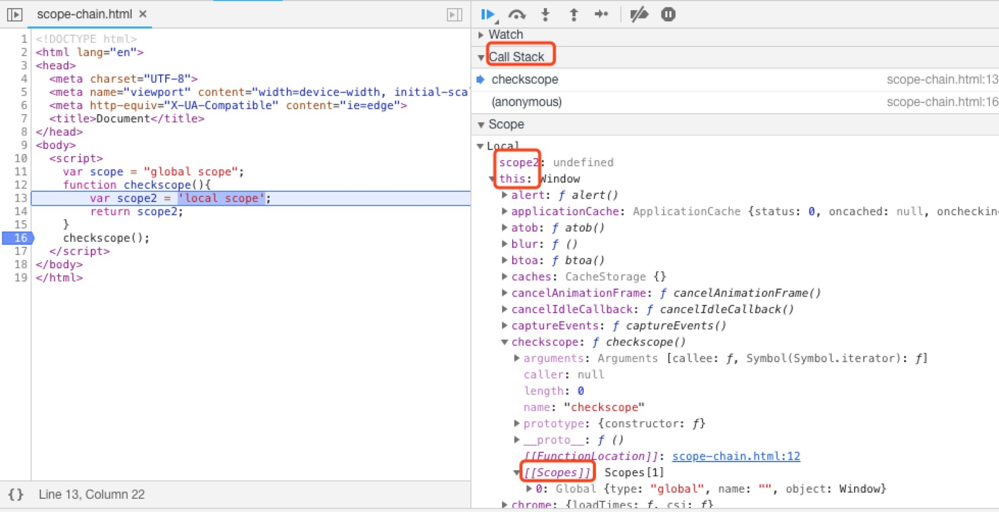

## 概念

什么是作用域和作用域链？或者换种说法，你被问及谈谈你对作用域和作用域链的理解。你会怎么回答？

当被问及这个问题时，我们应该归纳一下，从哪几个点去解释它

- 词语概念
  - 作用域  
    js中作用域有2种：全局和函数，规定了变量存在的区域。
  - 作用域链  
    用来控制作用域与作用域之间的访问权限  
- 作用场景
  - 作用域  
    js代码分为编译和执行2个阶段，在编译的时候便生成了作用域，因为在编译阶段已知了是全局还是函数。这一作用域被称为静态作用域或词法作用域。
  - 作用域链  
    在函数执行阶段，分为函数初始化和函数调用2个阶段。  
      - 在函数初始化时，会做3件事情：
        - **复制编译阶段的词法作用域**，用来创建当前环境的**作用域链**
        - 被推入调用栈（也称执行栈），此时会生成**执行上下文**、**变量对象 AO**、**this指向**  
        - 将变量对象压入作用域链的最顶端，完成初始化。
      - 函数调用时，变量对象成为活动对象，得到了当前环境最终的**作用域链**
- 二者的实际区别  
  其实我们平常所说的作用域没有太大的作用，有用的应该是指**执行上下文**，作用域在概念上讲是js自身用来分析标识符和词法的。区别：
  - 生成的时机不一致
  - 所表达的意义也不一致

tips: 作用域链的创建为何是通过复制，而且这个复制应该是深拷贝，因为函数会被调用多次。复制后在当前执行上下文得到一个临时的完整的作用域链随着调用栈的弹出而被销毁。

## 实例

```js
var scope = "global scope"
function checkscope(){
    var scope2 = 'local scope'
    return scope2
}
checkscope()
```

为了便于分析，我们可以在 checkscope 调用前打个断点，虽然看不到函数初始化的过程，但是能看到函数初始化后的结果。

分析步骤：

1、创建函数 checkscope，生成词法作用域，该作用域为 globalContext 全局作用域
```js
checkscope.[[Scopes]] = globalContext
```

2、初始化函数，复制得到当前作用域链
```js
checkscopeContext = {
  Scope: [checkscope.[[Scopes]]]
}
```

3、初始化函数，创建变量对象和this
```js
checkscopeContext = {
  Scope: [checkscope.[[Scopes]]],
  AO: {
    arguments: {},
    scope2: undefined
  },
  this: window
}
```

4、初始化函数，将变量对象压入作用域链最顶端，生成作用域链
```js
checkscopeContext = {
  AO: {
    arguments: {},
    scope2: undefined
  },
  this: window,
  Scope: [AO, checkscope.[[Scopes]]]
}
```

4、函数调用，变量对象成为活动对象，到此作用域链也就最终确定了
```js
checkscopeContext = {
  VO: {
    arguments: {},
    scope2: undefined
  },
  this: window,
  Scope: [VO, checkscope.[[Scopes]]]
}
```

## demo


## 链接

- [作用域链与闭包](https://yangbo5207.github.io/wutongluo/ji-chu-jin-jie-xi-lie/si-3001-zuo-yong-yu-lian-yu-bi-bao.html)
- [JavaScript深入之作用域链](https://github.com/mqyqingfeng/Blog/issues/6)

