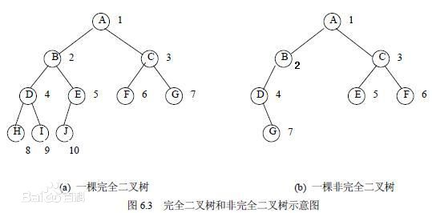

## 完全二叉树与堆排序

术语

- 深度 k
- 度数 
- 节点数 n
- 叶子节点

想当然，二叉树的度数为 2，完全二叉树是"不满"的满二叉树，满二叉树是指，非叶子节点都有2个子节点。

堆排序采用的就是完全二叉树这种数据结构，排序的方式有从大到小和从小到大，当然堆也分为

- 最大堆 每个节点都大于等于其子节点
- 最小堆 每个节点都小于等于其子节点



需要理解的3个公式，已知 i

- 父节点 `Math.floor((i - 1) / 2)`
- 左子节点 `2i + 1`
- 右子节点 `2i + 2`

## 实现

最大堆排序的思路为

- 从下往上、从右往左遍历，将最大值放在最后
- 已知排好序的长度 `sortLen`，遍历次数为 `arr.length - aortLen`
- 从当前索引 i 中，找到其兄弟节点与父节点，排序使其满足最大堆特性
- 排序后，如果当前节点存在子节点，则检查其"左右子节点三角形"是否满足最大堆特性，不满足则排序"左右子节点三角形"

```js
const heapSort = (function () {
  // 去重
  let lastPi
  // 已排序长度
  let sortLen
  // 数组
  let arr

  const swap = (leftIndex, rightIndex) => {
    [arr[leftIndex], arr[rightIndex]] = [arr[rightIndex], arr[leftIndex]]
  }

  const swapTriangle = (i) => {
    const leftIndex = 2 * i + 1
    const rightIndex = 2 * i + 2
    const arrBoundaryIndex = arr.length - sortLen

    if (rightIndex <= arrBoundaryIndex && arr[i] < arr[rightIndex]) {
      swap(i, rightIndex)
    }
    if (leftIndex <= arrBoundaryIndex && arr[i] < arr[leftIndex]) {
      swap(i, leftIndex)
    }
  }

  const maxHeapify = pi => {
    // 检查左、右子节点是否存在子节点，并重新排序
    const leftIndex = 2 * pi + 1
    const rightIndex = 2 * pi + 2
    swapTriangle(leftIndex)
    swapTriangle(rightIndex)
  }

  const poll = () => {
    if (arr[0] > arr[arr.length - sortLen]) {
      swap(0, arr.length - sortLen)
    }
  }

  return (origin = []) => {
    sortLen = 0
    arr = [...origin]
    while (sortLen < arr.length - 1) {
      sortLen += 1
      for (let i = arr.length - sortLen; i >= 1; i --) {
        const parentIndex = Math.floor((i - 1) / 2)
        if (parentIndex === lastPi) {
          continue
        }
        // 交换得到最大值
        swapTriangle(parentIndex)
        // 检查是否影响叶子节点排序，影响则重新按最大堆排序
        maxHeapify(parentIndex)
        lastPi = parentIndex
      }
      // 交换最大值与最小值
      poll()
      lastPi = undefined
    }
    sortLen = undefined
    return arr
  }
})()
```
